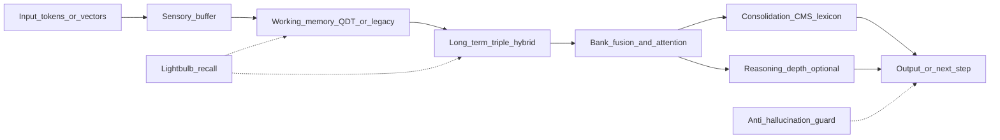

# Mnemnomic Cortex — Non-Coder Codebase Guide & Health Audit

**Audience:** people who need to understand what the system does without reading every line of code.  
**Scope:** active product code under `mnemonic_cortex/` and project scripts under `tools/`.  
**Excluded from commenting:** `tests/`, vendored `pytorch_new/`, and the frozen QD6A release pack inside working memory.

Status tags used in this guide and in file headers:

| Tag | Meaning |
|-----|---------|
| **WORKING** | Used and believed healthy for its intended job |
| **ACTIVE** | Turned on in normal / default builds |
| **OPT-IN** | Present in the codebase but off unless you enable it |
| **INERT** | Intentionally disabled (safety / policy) |
| **LEGACY** | Old path kept for compatibility or rollback |
| **UNUSED / LOW-USE** | Rarely exercised or weakly wired |
| **BUGGY / NEEDS FIX** | Known defect or incomplete behavior |
| **INCOMPLETE** | Interface exists; full capability not finished |

---

## 1. What this system is

Mnemnomic Cortex is a **memory-centric neural model**: instead of only “remembering” inside a single transformer, it routes information through several specialized memory systems that behave like different kinds of human memory.

In plain language:

1. **Sensory buffer** — short holding area for what just came in (like echoic / iconic memory).
2. **Working memory (WM)** — active scratchpad for the current task (QDT working memory is the modern design).
3. **Long-term memory (LTM)** — several long-lived banks fused together (episodes, meanings, space/topology, procedures).
4. **Consolidation** — moves / stabilizes useful patterns into longer-term stores (CMS, brokers, lexicon).
5. **Reasoning depth** — optional multi-layer “think deeper” routing across memory depths.
6. **Guards & lightbulb** — safety (anti-hallucination) and “aha” style recall triggers.

The main “brain” class is `EnhancedMnemonicCortex` in `mnemonic_cortex/cortex.py`.  
The main long-term fusion engine is `EnhancedTripleHybridMemory` in `mnemonic_cortex/triple_hybrid.py`.

---

## 2. How data flows

**Typical forward path**

1. Input arrives as numbers (vectors) or token IDs.
2. Sensory buffer shapes a short window of recent context.
3. Working memory builds an active representation (often with depth / quaternion structure in QDT-WM).
4. Long-term banks retrieve related memories (HG episodic, CGMN semantic, curved / SPCP procedural, spatial).
5. Fusion mixes those signals; optional consolidation and depth reasoning refine them.
6. Output heads / task decoders produce predictions (e.g. copy-task tokens).

---

## 3. Subsystem tours

### 3.1 Core spine (start here)

| File | What it does (plain language) | Status |
|------|-------------------------------|--------|
| `mnemonic_cortex/cortex.py` | The top-level “control room”: wires buffer, WM, LTM, consolidation, guards, optional stacks | **ACTIVE / WORKING** |
| `mnemonic_cortex/triple_hybrid.py` | Long-term memory factory: several memory banks + fusion + holographic slot banks | **ACTIVE / WORKING** |
| `mnemonic_cortex/config.py` | Named settings for sizes, flags, and capacities | **ACTIVE** |
| `mnemonic_cortex/config_loader.py` | Loads YAML / unified configs into real objects | **ACTIVE** |
| `mnemonic_cortex/capacity_profile.py` | Preset “small / standard / deep” capacity envelopes | **ACTIVE** |
| `mnemonic_cortex/sensory_buffer.py` | Short-term input ring / attention buffer | **ACTIVE** |
| `mnemonic_cortex/__init__.py` | Package exports for parameter-loop + CMS depth helpers | **ACTIVE** |

### 3.2 Memory banks and holographic storage

| File / cluster | What it does | Status |
|----------------|--------------|--------|
| `memory_hg.py` | Episodic-style hypergeometric / HG bank | **ACTIVE** |
| `memory_cgmn.py` | Semantic CGMN bank | **ACTIVE** |
| `memory_curved.py` | Curved / resonant bank (also legacy WM roots) | **ACTIVE / LEGACY overlap** |
| `memory_spatial_ltm.py` | Spatial / topological long-term atlas | **OPT-IN / ACTIVE when enabled** |
| `memory_attention.py` | Multi-scale attention used by memory reads/writes | **ACTIVE** |
| `memory_transformer_v2.py` | Transformer wrappers around memory banks | **ACTIVE** |
| `quantum_holographic.py` | “Hologram” slot store: codes + FFT binding for stacked memories | **WORKING** (GPU `.to()` migration fixed) |
| `consolidated_memory.py` | Consolidated Memory Store (CMS) with QH hooks | **ACTIVE when enabled** |
| `consolidated_memory_depth_stack.py` | Multi-geometry depth stack on top of CMS | **OPT-IN / ACTIVE in full-stack builds** |
| `parameter_storage_loop_stack.py` | Extra parameter / geometry storage loop | **OPT-IN** |
| `trainable_parameter_cps.py` | Second CPS that centrally owns real trainable model weights; exact first, optional validated low-rank compression | **OPT-IN** |
| `ltm_aux_memory.py` | Helper LTM banks (consolidated / neural field) | **ACTIVE / LOW-USE depending on build** |

**QH GPU note:** `qh_banks` on the triple-hybrid LTM is now an `nn.ModuleDict`, and codebook tensors move with `.to(device)`. Training no longer depends on a manual workaround for reliability.

### 3.3 Working memory (QDT) vs legacy

| Area | What it does | Status |
|------|--------------|--------|
| `working_memory/qdt_working_memory.py` | Modern working-memory stack (depths, fusion, commit gate) | **ACTIVE** when QDT enabled |
| `working_memory/wm_*.py` | Guards, attention lanes, adapters, shared slots, quality | Mostly **WORKING**; some **OPT-IN** |
| `working_memory/wm_compatibility_wrapper.py` | Lets older cortex code talk to QDT-WM | **ACTIVE / LEGACY bridge** |
| `working_memory/legacy_enhanced_curved_memory.py` | Older WM implementation kept around | **LEGACY** |
| `working_memory/qspin_*.py` (~50 files) | QSPIN bridge contracts / gates / sandboxes | **INERT** by project policy |
| `working_memory/qdt_wm_maae_…_release_pack/` | Frozen QD6A snapshot (do not treat as live code) | **LEGACY / VENDORED** — not re-commented |

Copy-task, bAbI, hidden-attention, benchmark, and smoke-training entry points
now select QDT working memory by default, with a legacy fallback where
applicable. This does **not** activate QSPIN: live routing, payload transfer,
shared-slot/QH writes, and commit execution remain disabled.

### 3.4 LTM package, shared slots, reasoning depth

| Area | What it does | Status |
|------|--------------|--------|
| `ltm/` | Package APIs for HG episodic, MANN, geometry keys, shared memory | **ACTIVE** with some alias shims |
| `memory/` | Shared-slot allocator, arbitrator, lifecycle | **OPT-IN** (not always on in standard profiles) |
| `reasoning_depth/` | Multi-depth reasoning lattice and adapters | Mostly **OPT-IN / INERT until enabled** |

### 3.5 Hypergraph / HGM

| Area | What it does | Status |
|------|--------------|--------|
| `hypergraph_manifold/` | Hypergraph / procedural manifold scaffolding, write-prep, dry-runs | Mix of **WORKING scaffolds** and **LOW-USE / dry-run** artifacts |

### 3.6 Consolidation, lexicon, CPS, routing, safety

| Cluster | Role | Status |
|---------|------|--------|
| `consolidation_broker*.py`, `cms_ops.py`, `cms_index.py` | Schedule and apply consolidation | **ACTIVE when CMS path on** |
| `consolidated_lexicon.py`, `cps*.py`, `multi_cps.py` | Vocabulary / parameter stores and fusion | **ACTIVE / OPT-IN** by feature |
| `lightbulb*.py` | Detect “important” moments and boost recall | **OPT-IN / ACTIVE when enabled** |
| `ahg.py`, `anti_hallucination.py` | Anti-hallucination guard | **OPT-IN** |
| `router_advanced.py`, `hybrid_router_v2.py` | Route which memory / domain to use | **ACTIVE** inside LTM/cortex paths |
| `hidden_attention_orchestrator.py` | Collects hidden activations across modules | **ACTIVE** in full stacks |
| `model_audit.py`, `parameter_audit.py`, `diagnostics.py` | Measurement / introspection tools | **WORKING** (developer utilities) |

### 3.7 Re-export shim packages

These folders mostly **point elsewhere** so old import paths keep working:

- `core/`, `consolidation/`, `routing/`, `quant/`, `fusion/`, `distill/`, `geometry/`

Status: **LEGACY / SHIM** — real logic lives at the package root or named subpackages.

### 3.8 Project tools (`tools/`)

| Script | Purpose | Status |
|--------|---------|--------|
| `copy_task_gpu_train.py` | Main GPU copy/reverse training loop | **WORKING** |
| `run_hidden_attention_task.py` | Hidden-attention stress task | **WORKING** |
| `comprehensive_model_audit.py` | Writes layer/parameter audit reports | **WORKING** |
| `count_model_params.py` | Prints parameter counts for configs | **WORKING** |
| `babi_train_eval.py` | bAbI QA train/eval | **WORKING** (depends on dataset) |
| `eval_ahg.py` / `eval_adapters.py` | Anti-hallucination evaluation | **WORKING** |
| `cms_train_loop.py` | Minimal CMS training sketch | **LOW-USE / sketch** |
| `profile.py` | Timing benchmarks | **WORKING** |
| `_apply_plain_language_headers.py` | Inserts non-coder headers across the package | **WORKING (maintenance)** |
| `_fix_header_future_order.py` | Ensures headers sit before `__future__` imports | **WORKING (maintenance)** |
| `_refresh_wm_headers.py` / `_refresh_tool_headers.py` | One-off header refresh helpers | **WORKING (maintenance)** |

---

## 4. Health register (honest status)

### Fixed recently

| Item | Status | Notes |
|------|--------|-------|
| LTM `qh_banks` stuck on CPU after `model.to(cuda)` | **WORKING** | Converted to `ModuleDict`; codebook tensors migrate via `_apply` |
| LTM adapter `top_k` excluding `"fused"` bank | **WORKING** | Adapter always pins fused bank |

### Intentionally inert / deferred

| Item | Status | Notes |
|------|--------|-------|
| QSPIN stages 0–8 (`working_memory/qspin_*.py`, ~50 files) | **INERT** | No live bridge routing / payload / commits unless future stage authorizes |
| Production live activation (prod8) | **BLOCKED / HOLD** | Operator / safety gates, not a silent code path |
| WM QH persistent storage backend (`wm_quantum_holographic_storage.py`) | **INCOMPLETE** | Metadata/interface compatible; durable backend deferred |
| Reasoning-depth adapters | **OPT-IN** | Off unless explicitly enabled |
| Shared-slot subsystem (`memory/`) | **OPT-IN** | Not default in all capacity profiles |
| Parameter storage loop training writes | **OPT-IN** | Often read-only / disabled by default |
| Trainable shared-parameter CPS | **OPT-IN** | Disabled by default; exact consolidation must validate before commit; compression is separately gated; sparse exceptions and irreversible finalize/release are available after probe validation |
| Hybrid neural capacity profile (AMP dtype, SDPA preference, activation checkpointing, task-decoder shared GQA, CPS↔loop handle routing) | **OPT-IN** | Defaults unchanged; QDT attention edits deferred until QD6A source-truth inventory is present; literal vs routing capacity kept separate |

### Legacy / duplicate / parameter cost

| Item | Status | Notes |
|------|--------|-------|
| Legacy working memory (`legacy_enhanced_curved_memory.py`) kept after QDT migration | **LEGACY** | Still can consume ~8M+ parameters if retained |
| WM-7A / nested QD6A release pack | **LEGACY** | Historical source-of-truth snapshot; do not edit as live code |
| `topology_manager.py` vs `topology_manager_v2.py` | **LEGACY + ACTIVE** | Prefer v2 in modern cortex wiring |
| `consolidation_broker.py` vs `_v2` | **LEGACY + ACTIVE** | Prefer v2 where cortex wires it |
| Re-export shims (`core/`, `routing/`, `quant/`, `fusion/`, `distill/`, `geometry/`, `consolidation/`) | **LEGACY / SHIM** | Import aliases only |
| `ltm/mnemonic_cortex.py` etc. | **LEGACY / LOCAL COPY** | Prefer top-level cortex for product |

### Incomplete / needs attention

| Item | Status | Notes |
|------|--------|-------|
| Full pytest suite residual failures | **NEEDS TRIAGE** | Prior full run ~861 pass / ~14 fail in unrelated areas (multi-CPS HG flush, quantization, router regressions, shared-slot contracts, geometry utils) |
| Copy-reverse training run | **INCOMPLETE** | Interrupted mid-curriculum (~264/500 steps in prior session) |
| Training helpers `_move_qh_codebooks_to_device` | **LOW-USE** | Kept as belt-and-suspenders; primary fix is in LTM/QH modules |
| Many HGM dry-run / sandbox modules | **LOW-USE** | Contract / audit scaffolding more than daily runtime |
| `cms_train_loop.py` | **LOW-USE / sketch** | Prefer `copy_task_gpu_train.py` for real GPU work |
| `holo_head.py` | **OPT-IN / LOW-USE** | Not always the main task decoder |

### Findings from the header annotation pass

- **~388** active `mnemonic_cortex` Python files and **all** project `tools/*.py` now carry a plain-language header with a status tag.
- QSPIN files were labeled **INERT** as a batch (policy, not accidental dead code).
- Shim packages were labeled **LEGACY / SHIM** to discourage editing them as if they owned logic.
- Large files (`cortex.py`, `triple_hybrid.py`, `copy_task_gpu_train.py`) received major **section banners** for INIT/BUILD, feature switches, forward path, and holographic banks.
- Vendored QD6A release pack and `tests/` were intentionally left untouched.

### Utilization note (not necessarily bugs)

Model audits often show many registered submodules **not activated** on a single probe batch. That can mean path-dependent features (optional banks, guards, consolidation) rather than dead code. Treat “skipped in probe” as a clue, not an automatic bug.

---

## 5. What not to edit (unless you know why)

1. **`pytorch_new/`** — vendored PyTorch tree; not product logic.
2. **`mnemonic_cortex/working_memory/qdt_wm_maae_wm_qd6a_quality_deepened_final_release_pack/`** — frozen QD6A pack.
3. **Historical WM-7A materials** — comparison / rollback only where QD6A differs.
4. **QSPIN inert contracts** — do not “activate” without an explicit guarded stage authorization (see `AGENTS.md` and chat-context manifests).

---

## 6. How to use this guide with the code

1. Read this document for the map and health picture.
2. Open a file; the **module header** (top docstring) repeats purpose + status in plain language.
3. For huge files (`cortex.py`, `triple_hybrid.py`, `copy_task_gpu_train.py`), look for **section banners** such as `INIT / BUILD`, `FORWARD PATH`, `MEMORY WRITE PATH`.
4. Prefer changing **active** paths (`cortex.py`, `triple_hybrid.py`, `working_memory/qdt_*.py`, `quantum_holographic.py`) over shims and release packs.

---

## 7. File-cluster inventory (active package)

Approximate active Python counts (excluding the QD6A release pack):

| Area | ~Files | Role |
|------|--------|------|
| Top-level `mnemonic_cortex/*.py` | 57 | Core product modules |
| `working_memory/` (active) | ~116 | QDT-WM + QSPIN inert + quality |
| `hypergraph_manifold/` | ~93 | HGM scaffolds |
| `reasoning_depth/` | ~61 | Depth reasoning |
| `ltm/` | ~18 | LTM package |
| `memory/` | ~13 | Shared slots |
| Shim packages | ~30 | Import aliases |
| `tools/*.py` | 13 | Training / eval / audit / doc maintenance scripts |

Every active module in those areas carries a plain-language header with a status tag.

### 7.1 Top-level module list (quick index)

- **Spine:** `cortex`, `triple_hybrid`, `sensory_buffer`, `config`, `config_loader`, `capacity_profile`
- **Banks:** `memory_hg`, `memory_cgmn`, `memory_curved`, `memory_spatial_ltm`, `memory_attention`, `memory_transformer_v2`, `memory_consolidation_manager_v2`
- **Holographic / CMS:** `quantum_holographic`, `consolidated_memory`, `consolidated_memory_depth_stack`, `parameter_storage_loop_stack`, `cms_ops`, `cms_index`
- **Literal trainable consolidation:** `trainable_parameter_cps` owns canonical exact slabs and optional shared-template/low-rank cohorts. Its capacity report counts physical scalars rather than manifold scalar-equivalents.
- **Consolidation / CPS:** `consolidation_broker`, `consolidation_broker_v2`, `consolidation_scheduler`, `consolidated_lexicon`, `cps`, `cps_fuser`, `cps_vocab_bridge`, `multi_cps`
- **Safety / recall:** `ahg`, `anti_hallucination`, `lightbulb`, `lightbulb_recall_v2`, `lightbulb_controller`, `lightbulb_event_logger`
- **Routing / geometry:** `hybrid_router_v2`, `router_advanced`, `router_losses`, `topology_manager`, `topology_manager_v2`, `geometry_utils`, `geometry_merger`
- **Wiring helpers:** `spatial_ltm_cortex_wiring`, `hg_episodic_cortex_wiring`, `candidate_view_builder`, `conflict_resolver`, `hidden_attention_orchestrator`
- **Ops / audit:** `diagnostics`, `model_audit`, `parameter_audit`, `optimizer`, `utils`, `train_smoke`, `holo_head`, `quantization`, `quant_fuser`, `distillation`, `ltm_aux_memory`

### 7.2 Working-memory clusters

- **Runtime:** `qdt_working_memory`, `wm_config`, `wm_cortex_integration`, `wm_compatibility_wrapper`, `wm_context_mount`, dual fusion / depth / attention / commit-gate modules
- **Guards & quality:** `wm_*_guards`, `quality/*`
- **External memory adapters:** LTM / MANN / SPCP / triple-hybrid adapters
- **QSPIN:** all `qspin_*` → treat as **INERT** documentation of future bridge stages
- **Legacy:** `legacy_enhanced_curved_memory`

### 7.3 Reasoning-depth / LTM / memory / HGM

- **reasoning_depth:** controller, route strategy, depth banks/adapters, dry-run/audit contracts
- **ltm:** system entry, HG episodic, MANN reasoner, manifold ops, alias packages
- **memory:** shared-slot store, arbitrator (and typo shim `shared_slot_arbitrater`), lifecycle
- **hypergraph_manifold:** expander, routers, procedural memory, write-prep, sandbox/dry-run results

---

## 8. Related deeper reports

For technical depth (still useful after this guide):

- `reports/model_neural_memory_system_report.md` — WM/LTM/MANN architecture
- `reports/effective_parameter_storage_report.md` — literal vs effective capacity
- `reports/model_comprehensive_audit.md` — layer visibility / parameter probe
- `docs/chat_context/qspin_stage_0_to_8_manifest.md` — QSPIN inert stages
- `docs/qdt_wm_maae_quality/46_wm_qd6a_production_readiness.md` — production readiness gaps

---

*Generated as the non-coder map for Mnemnomic Cortex. Module headers in source files mirror this status language. Header annotation pass completed for active package + tools.*
